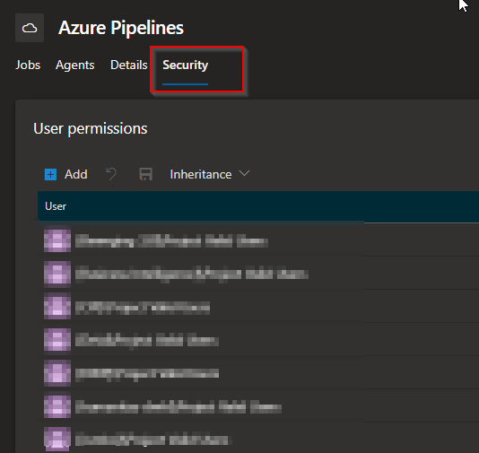

# Agent pool permissions

In Azure Pipelines, pools are scoped to the entire organization; so you can share the agent machines across projects.

When you configure an agent, it is registered with a single pool, and when you create a pipeline, you specify which pool the pipeline uses. When you run the pipeline, it runs on an agent from that pool that meets the [demands](https://docs.microsoft.com/en-us/azure/devops/pipelines/process/demands?view=azure-devops) of the pipeline.

## Default agent pools

The following agent pools are provided by default:

- **Default** pool: Use it to register [self-hosted agents](https://docs.microsoft.com/en-us/azure/devops/pipelines/agents/agents?view=azure-devops) that you've set up.

- **Azure Pipelines** hosted pool with various Windows, Linux, and macOS images. For a complete list of the available images and their installed software, see [Microsoft-hosted agents](https://docs.microsoft.com/en-us/azure/devops/pipelines/agents/hosted?view=azure-devops#use-a-microsoft-hosted-agent).
  
  

*By default, all contributors in a project are members of the **User** role on hosted pools. This allows every contributor in a project to author and run pipelines using Microsoft-hosted agents.*

For most uses, the use of the 2 default pools suffices. You can use the Azure Pipelines for most uses. If you need agents in a speficic location for the "Line of sight" you can use a self hosted agent in the Default pool. 

However, when the self hosted agent is in the Default pool, it can be used by any project. 

Here are some typical situations when you might want to create self-hosted agent pools for one or a few project:

- You're a member of a project and you want to use a set of machines owned by your team for running build and deployment jobs. 

- You want to share a set of agent machines with multiple projects, but not all of them. 

- You need a set of agent machines with specific software installed. You may want or not want to share this among teams. 

## Security of agent pools

Understanding how security works for agent pools helps you control sharing and use of agents.

### Permissions on Organization level

**Roles** are defined on each agent pool, and **membership** in these roles governs what operations you can perform on an agent pool.

**Reader**:  Members of this role can view the agent pool as well as agents. You typically use this to add operators that are responsible for monitoring the agents and their health. 

**Service Account**: Members of this role can use the organization agent pool to create a project agent pool in a project.

**Administrator**: In addition to all the above permissions, members of this role can register or unregister agents from the organization agent pool. They can also refer to the organization agent pool when creating a project agent pool in a project. Finally, they can also manage membership for all roles of the organization agent pool. The user that created the organization agent pool is automatically added to the Administrator role for that pool. 

### Permissions on Project level

Roles are also defined on each project agent pool, and memberships in these roles govern what operations you can perform on an agent pool at the project level.

**Reader**:  Members of this role can view the project agent pool. You typically use this to add operators that are responsible for monitoring the build and deployment jobs in that project agent pool. 

**User**: Members of this role can use the project agent pool when authoring pipelines.

**Administrator**: In addition to all the above operations, members of this role can manage membership for all roles of the project agent pool. The user that created the pool is automatically added to the Administrator role for that pool.

The **Security** action in the Agent pools tab is used to control the security of *all* project agent pools in a project. Role memberships for individual project agent pools are automatically inherited from what you define here. By default, the following groups are added to the Administrator role of 'All agent pools': Build Administrators, Release Administrators, Project Administrators.

If there is no reason to have a specific agent pool for your team eg. for the examples mentioned before it is a best practice to use the built-in agent pools. 

If queuing of build is a reason, it is worth to have a look into the option to use Azure Virtual Machine Scale sets so the pool can grow depening on the load. 

## Azure virtual machine scale set agents

Azure virtual machine scale set agents are a form of self-hosted agents that can be auto-scaled to meet your demands. This elasticity reduces your need to run dedicated agents all the time. Unlike Microsoft-hosted agents, you have flexibility over the size and the image of machines on which agents run.

You specify a virtual machine scale set, a number of agents to keep on standby, a maximum number of virtual machines in the scale set, and Azure Pipelines manages the scaling of your agents for you.

For more information, see [Azure virtual machine scale set agents](https://docs.microsoft.com/en-us/azure/devops/pipelines/agents/scale-set-agents?view=azure-devops).

